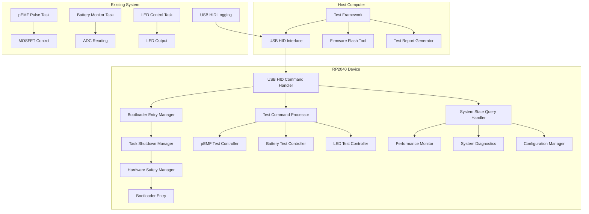

# Design Document

## Overview

This design document outlines the implementation of automated testing and validation capabilities for the RP2040 pEMF/battery monitoring device. The system extends the existing USB HID logging infrastructure to support bidirectional communication, enabling remote bootloader entry, test command execution, and comprehensive system validation.

The design leverages the existing USB HID interface and RTIC task architecture while adding new command processing capabilities that maintain the system's real-time constraints and priority hierarchy.

## Architecture

### High-Level System Architecture



### Communication Protocol Architecture

The system uses a dual-channel approach:
1. **Command Channel**: Host → Device commands via USB HID Output Reports
2. **Response Channel**: Device → Host responses via existing USB HID Input Reports (logging system)

### Command Protocol Structure

All commands use a standardized 64-byte HID report format:

```
Byte 0:     Command Type (0x80-0xFF for test commands)
Byte 1:     Command ID (sequence number for tracking)
Byte 2:     Payload Length (0-61 bytes)
Byte 3:     Authentication Token (simple checksum for validation)
Bytes 4-63: Command Payload (command-specific data)
```

## Components and Interfaces

### 1. USB HID Command Handler

**Purpose**: Process incoming USB HID output reports containing test commands and bootloader requests.

**Interface**:
```rust
pub struct UsbCommandHandler {
    command_queue: heapless::spsc::Queue<TestCommand, 8>,
    response_queue: heapless::spsc::Queue<TestResponse, 8>,
    auth_validator: AuthenticationValidator,
}

pub enum TestCommand {
    EnterBootloader { timeout_ms: u32 },
    SystemStateQuery { query_type: StateQueryType },
    ExecuteTest { test_type: TestType, parameters: TestParameters },
    ConfigurationQuery { config_type: ConfigType },
    PerformanceMetrics { metric_type: MetricType },
}

pub enum TestResponse {
    Ack { command_id: u8, status: ResponseStatus },
    StateData { query_type: StateQueryType, data: StateData },
    TestResult { test_type: TestType, result: TestResult },
    Error { error_code: ErrorCode, message: &'static str },
}
```

**Priority**: Medium (Priority 2) - processes commands without interfering with critical timing

**Integration**: Extends existing USB HID infrastructure, reuses logging transmission mechanism

### 2. Bootloader Entry Manager

**Purpose**: Safely transition the device from normal operation to bootloader mode.

**Interface**:
```rust
pub struct BootloaderEntryManager {
    shutdown_sequence: TaskShutdownSequence,
    hardware_safety: HardwareSafetyManager,
    timeout_timer: Option<TimerHandle>,
}

impl BootloaderEntryManager {
    pub fn request_bootloader_entry(&mut self, timeout_ms: u32) -> Result<(), BootloaderError>;
    pub fn execute_safe_shutdown(&mut self) -> Result<(), BootloaderError>;
    pub fn enter_bootloader_mode(&self) -> !;
}
```

**Safety Mechanisms**:
- Graceful task shutdown in reverse priority order (LED → Battery → pEMF)
- Hardware state validation before bootloader entry
- Timeout protection to prevent indefinite bootloader mode
- Log message flushing to preserve diagnostic data

**Implementation Strategy**:
Uses RP2040's software reset mechanism combined with magic value in RAM to trigger bootloader mode entry. The implementation leverages the `rp2040-hal` crate's reset functionality.

### 3. Test Command Processor

**Purpose**: Execute automated test scenarios and collect results.

**Interface**:
```rust
pub struct TestCommandProcessor {
    active_test: Option<ActiveTest>,
    test_results: heapless::Vec<TestResult, 16>,
    test_timeout: Option<TimerHandle>,
}

pub enum TestType {
    PemfTimingValidation { duration_ms: u32, tolerance_percent: f32 },
    BatteryAdcCalibration { reference_voltage: f32 },
    LedFunctionality { pattern: LedTestPattern },
    SystemStressTest { duration_ms: u32, load_level: u8 },
    UsbCommunicationTest { message_count: u32 },
}

pub struct TestResult {
    test_type: TestType,
    status: TestStatus,
    measurements: TestMeasurements,
    error_details: Option<&'static str>,
}
```

**Test Implementation Strategy**:
- Tests run as separate RTIC tasks with appropriate priorities
- Non-intrusive monitoring of existing system behavior
- Configurable test parameters and duration
- Comprehensive result collection and reporting

### 4. System State Query Handler

**Purpose**: Provide real-time system status and diagnostic information.

**Interface**:
```rust
pub struct SystemStateHandler {
    performance_monitor: PerformanceMonitor,
    diagnostic_collector: DiagnosticCollector,
    config_manager: ConfigurationManager,
}

pub enum StateQueryType {
    SystemHealth,
    TaskPerformance,
    HardwareStatus,
    ConfigurationDump,
    ErrorHistory,
}

pub struct SystemHealthData {
    uptime_ms: u32,
    task_health: TaskHealthStatus,
    memory_usage: MemoryUsageStats,
    error_counts: ErrorCounters,
}
```

### 5. Host-Side Test Framework

**Purpose**: Orchestrate automated testing workflows from the host computer.

**Architecture**:
```python
class AutomatedTestFramework:
    def __init__(self):
        self.device_manager = UsbHidDeviceManager()
        self.test_sequencer = TestSequencer()
        self.result_collector = ResultCollector()
        self.report_generator = ReportGenerator()
    
    def run_test_suite(self, test_config: TestConfiguration) -> TestReport:
        # Device discovery and connection
        # Test sequence execution
        # Result collection and analysis
        # Report generation
```

**Key Components**:
- **Device Manager**: USB HID device discovery and communication
- **Test Sequencer**: Test execution orchestration and timing
- **Firmware Flasher**: Bootloader mode triggering and firmware deployment
- **Result Collector**: Test data aggregation and analysis
- **Report Generator**: Comprehensive test reporting (JUnit XML, JSON, HTML)

## Data Models

### Command Authentication

Simple checksum-based authentication to prevent accidental command execution:

```rust
pub struct AuthenticationValidator {
    expected_checksum: u8,
}

impl AuthenticationValidator {
    pub fn validate_command(&self, command: &[u8]) -> bool {
        let calculated_checksum = command[0..3].iter().fold(0u8, |acc, &b| acc.wrapping_add(b));
        calculated_checksum == command[3]
    }
}
```

### Test Parameters and Results

```rust
pub struct TestParameters {
    duration_ms: u32,
    tolerance_percent: f32,
    sample_rate_hz: u32,
    validation_criteria: ValidationCriteria,
}

pub struct TestMeasurements {
    timing_accuracy: f32,
    resource_usage: ResourceUsageStats,
    error_count: u32,
    performance_metrics: PerformanceMetrics,
}
```

### System Diagnostics

```rust
pub struct SystemDiagnostics {
    task_execution_times: TaskExecutionTimes,
    memory_usage: MemoryUsageStats,
    hardware_status: HardwareStatus,
    error_history: ErrorHistory,
}

pub struct TaskExecutionTimes {
    pemf_task_avg_us: u32,
    battery_task_avg_us: u32,
    led_task_avg_us: u32,
    usb_task_avg_us: u32,
}
```

## Error Handling

### Error Categories

1. **Command Validation Errors**: Invalid command format, authentication failure
2. **Test Execution Errors**: Test timeout, hardware failure during test
3. **Bootloader Entry Errors**: Unsafe system state, hardware lock
4. **Communication Errors**: USB disconnection, transmission failure

### Error Recovery Strategies

```rust
pub enum ErrorRecoveryAction {
    RetryCommand { max_attempts: u8 },
    AbortTest { preserve_state: bool },
    SafeSystemReset { bootloader_mode: bool },
    LogAndContinue { error_level: LogLevel },
}

pub struct ErrorRecoveryManager {
    recovery_strategies: heapless::FnvIndexMap<ErrorCode, ErrorRecoveryAction, 16>,
    error_history: heapless::Vec<ErrorRecord, 32>,
}
```

### Graceful Degradation

- Test commands that fail don't affect normal device operation
- Bootloader entry failures leave the device in normal operation mode
- Communication errors are logged and retried with exponential backoff
- System maintains real-time constraints even during error conditions

## Testing Strategy

### Unit Testing

- Command parsing and validation logic
- Authentication mechanism
- Test parameter validation
- Error handling paths

### Integration Testing

- USB HID command/response communication
- Bootloader entry sequence
- Test execution with real hardware
- Multi-device testing scenarios

### Performance Testing

- Command processing latency impact
- Memory usage during test execution
- Real-time constraint validation
- Long-term stability testing

### Hardware-in-the-Loop Testing

- Automated firmware flashing cycles
- Physical hardware validation
- Environmental stress testing
- Regression testing across firmware versions

## Security Considerations

### Command Authentication

- Simple checksum validation prevents accidental command execution
- Command sequence numbers prevent replay attacks
- Rate limiting prevents command flooding

### Bootloader Entry Protection

- Authentication required for bootloader commands
- Timeout protection prevents indefinite bootloader mode
- Safe state validation before bootloader entry
- Logging of all bootloader entry attempts

### Test Command Validation

- Parameter range validation for all test commands
- Resource usage limits during test execution
- Test timeout protection
- Isolation between test execution and normal operation

## Performance Impact Analysis

### CPU Usage Impact

- Command processing: <2% additional CPU usage
- Test execution: Configurable, typically <10% during active testing
- Bootloader entry: Temporary spike during shutdown sequence

### Memory Usage Impact

- Command queue: ~256 bytes
- Test result storage: ~1KB
- Additional code size: ~4KB

### Real-Time Constraint Preservation

- pEMF pulse timing maintained within ±1% tolerance
- Battery monitoring frequency unchanged
- LED control responsiveness preserved
- USB logging performance maintained

## Implementation Phases

### Phase 1: Basic Command Infrastructure
- USB HID output report handling
- Command parsing and validation
- Basic response mechanism

### Phase 2: Bootloader Entry System
- Safe shutdown sequence implementation
- Hardware state validation
- Bootloader mode entry mechanism

### Phase 3: Test Command Framework
- Test execution infrastructure
- Result collection and reporting
- Performance monitoring integration

### Phase 4: Host-Side Framework
- Python test framework development
- CI/CD integration capabilities
- Multi-device testing support

### Phase 5: Advanced Features
- Comprehensive test scenarios
- Performance optimization
- Security enhancements
- Documentation and examples