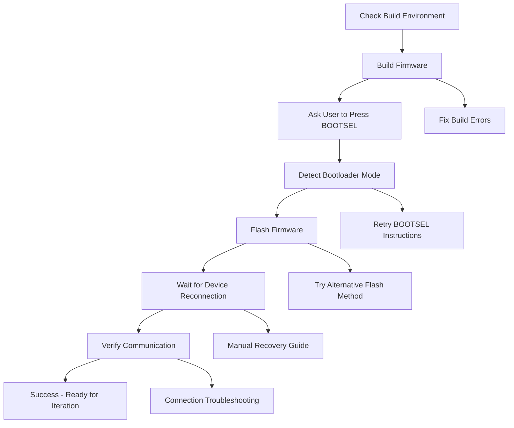

# Design Document

## Overview

This design document outlines the practical approach for establishing basic firmware build and flash capability for the RP2040 device. The focus is on getting the most fundamental operations working: building firmware, getting the device into bootloader mode, flashing firmware, and verifying it runs.

This is not about building elaborate frameworks - it's about getting the basic mechanics working so the AI agent can actually test code on real hardware.

## Architecture

### Simple Linear Process Flow



### Key Components

1. **Build System Interface**: Direct cargo commands for firmware compilation
2. **Device Detection**: USB device enumeration to find bootloader and normal modes
3. **Flash Tool Integration**: picotool or direct file copy to bootloader mount
4. **Communication Verification**: Basic USB HID communication test
5. **Error Recovery**: Manual procedures when automation fails

## Implementation Strategy

### Phase 1: Environment Verification

**Objective**: Ensure all tools and dependencies are available

**Implementation**:
- Check Rust toolchain installation (`rustc --version`)
- Verify RP2040 target is installed (`rustup target list --installed`)
- Check for picotool availability (`which picotool`)
- Verify UF2 conversion tools if needed
- Install missing dependencies with user guidance

**Success Criteria**: All required tools are available and functional

### Phase 2: Firmware Build Process

**Objective**: Successfully build firmware binary from source

**Implementation**:
```bash
# Navigate to project directory
cd /path/to/project

# Clean previous builds
cargo clean

# Build release firmware
cargo build --release --target thumbv6m-none-eabi

# Convert to UF2 if needed
elf2uf2-rs target/thumbv6m-none-eabi/release/firmware firmware.uf2
```

**Error Handling**:
- Parse cargo build output for specific errors
- Fix common issues (missing dependencies, compilation errors)
- Guide user through manual fixes for complex issues

**Success Criteria**: Firmware binary is successfully created

### Phase 3: Bootloader Mode Entry

**Objective**: Get device into bootloader mode for flashing

**Implementation**:
1. **User-Assisted Method** (Primary):
   - Ask user to disconnect device
   - Ask user to hold BOOTSEL button
   - Ask user to reconnect device while holding BOOTSEL
   - Detect USB mass storage device appearance

2. **Software Method** (Secondary, if firmware supports it):
   - Send bootloader entry command via USB HID
   - Wait for device disconnection
   - Detect bootloader mode appearance

**Device Detection**:
```python
import usb.core
import time

def detect_bootloader_device():
    # Look for RP2040 bootloader (VID:PID = 2E8A:0003)
    device = usb.core.find(idVendor=0x2E8A, idProduct=0x0003)
    return device is not None

def wait_for_bootloader(timeout=30):
    start_time = time.time()
    while time.time() - start_time < timeout:
        if detect_bootloader_device():
            return True
        time.sleep(1)
    return False
```

**Success Criteria**: Device appears as RP2040 bootloader USB device

### Phase 4: Firmware Flashing

**Objective**: Deploy firmware to the device

**Implementation Options**:

1. **Using picotool** (Preferred):
```bash
picotool load firmware.uf2 --force
```

2. **Direct file copy** (Fallback):
```bash
# Find bootloader mount point
mount_point=$(mount | grep RPI-RP2 | cut -d' ' -f3)
# Copy firmware
cp firmware.uf2 "$mount_point/"
```

3. **Mount point detection**:
```python
import os
import subprocess

def find_bootloader_mount():
    # Check common mount points
    common_mounts = ['/media/RPI-RP2', '/mnt/RPI-RP2', '/Volumes/RPI-RP2']
    for mount in common_mounts:
        if os.path.exists(mount) and os.path.ismount(mount):
            return mount
    
    # Parse mount output
    try:
        result = subprocess.run(['mount'], capture_output=True, text=True)
        for line in result.stdout.split('\n'):
            if 'RPI-RP2' in line:
                parts = line.split()
                if len(parts) >= 3:
                    return parts[2]
    except:
        pass
    
    return None
```

**Success Criteria**: Firmware is successfully written to device

### Phase 5: Device Reconnection and Verification

**Objective**: Confirm device boots with new firmware and is communicating

**Implementation**:

1. **Wait for Reconnection**:
```python
def wait_for_device_reconnection(target_vid=0x2E8A, target_pid=0x000A, timeout=30):
    start_time = time.time()
    while time.time() - start_time < timeout:
        device = usb.core.find(idVendor=target_vid, idProduct=target_pid)
        if device:
            return True
        time.sleep(1)
    return False
```

2. **Basic Communication Test**:
```python
import hid

def test_hid_communication():
    try:
        # Open HID device
        device = hid.device()
        device.open(0x2E8A, 0x000A)  # Adjust VID/PID as needed
        
        # Try to read some data (non-blocking)
        data = device.read(64, timeout_ms=1000)
        device.close()
        
        return len(data) > 0
    except:
        return False
```

**Success Criteria**: Device reconnects and responds to basic communication

## Error Handling and Recovery

### Build Failures
- **Missing Rust Target**: Guide user through `rustup target add thumbv6m-none-eabi`
- **Compilation Errors**: Parse error output and provide specific fixes
- **Dependency Issues**: Check Cargo.toml and guide dependency installation

### Bootloader Entry Failures
- **Device Not Detected**: Provide step-by-step BOOTSEL instructions
- **Wrong Device Mode**: Guide user through disconnect/reconnect cycle
- **USB Issues**: Check USB connections and try different ports

### Flashing Failures
- **picotool Not Found**: Guide installation or fall back to file copy
- **Mount Point Not Found**: Help user manually locate bootloader drive
- **Permission Issues**: Guide user through permission fixes

### Communication Failures
- **Device Not Reconnecting**: Wait longer, check connections
- **HID Communication Failed**: Verify device drivers, try different approaches
- **Wrong Firmware**: Verify build process and flash again

## Manual Recovery Procedures

### Device Completely Unresponsive
1. Disconnect device from USB
2. Hold BOOTSEL button
3. Reconnect while holding BOOTSEL
4. Release BOOTSEL after connection
5. Device should appear as mass storage
6. Copy known-good firmware manually

### Build Environment Issues
1. Verify Rust installation: `curl --proto '=https' --tlsv1.2 -sSf https://sh.rustup.rs | sh`
2. Add RP2040 target: `rustup target add thumbv6m-none-eabi`
3. Install elf2uf2-rs: `cargo install elf2uf2-rs`
4. Install picotool if available

### USB/Driver Issues
1. Check device manager (Windows) or lsusb (Linux)
2. Try different USB ports
3. Check for driver issues
4. Restart if necessary

## Success Metrics

### Immediate Success
- Firmware builds without errors
- Device enters bootloader mode reliably
- Firmware flashes successfully
- Device reconnects and communicates

### Iterative Success
- Can complete 3 consecutive successful flash cycles
- Process is documented and repeatable
- Error recovery procedures are tested
- Ready for autonomous iteration

## Tools and Dependencies

### Required Tools
- Rust toolchain with thumbv6m-none-eabi target
- elf2uf2-rs for UF2 conversion
- Python with pyusb and hidapi libraries

### Optional Tools
- picotool (preferred for flashing)
- uf2conv.py (alternative conversion)

### Platform-Specific Requirements
- **Linux**: udev rules for USB device access
- **Windows**: Device drivers for RP2040
- **macOS**: System permissions for USB access

## Implementation Notes

### Keep It Simple
- Use direct command execution rather than complex abstractions
- Prefer explicit error checking over silent failures
- Document every working step for repeatability

### User Interaction
- Clear, specific instructions for manual steps
- Wait for user confirmation before proceeding
- Provide detailed error messages with next steps

### Incremental Progress
- Test each component independently
- Build confidence through repeated success
- Document working procedures immediately

This design focuses on getting the basics working reliably rather than building elaborate systems. Once the fundamental flash cycle works, the agent can iterate and improve autonomously.