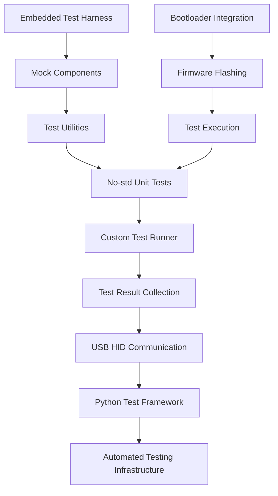
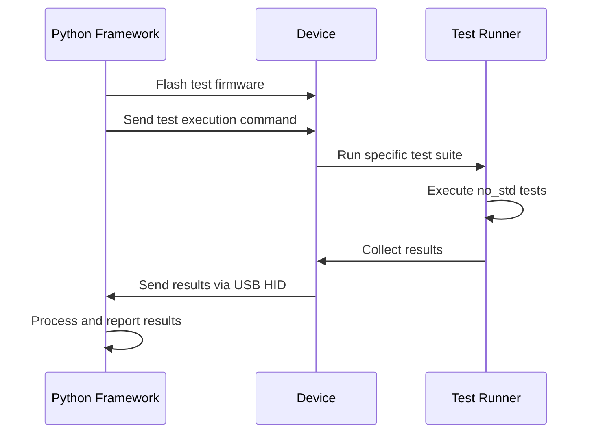

# Design Document

## Overview

This design document outlines the comprehensive approach for fixing all unit tests in the project to work with the `thumbv6m-none-eabi` target (no_std environment). The core issue is that the tests were written assuming a standard library environment, but the project targets embedded hardware that doesn't support `std`.

The solution involves systematically converting all tests to be no_std compatible while maintaining integration with the existing automated testing bootloader infrastructure and Python-based test framework.

## Architecture

### Current State Analysis

The project has approximately 30+ test files in the `tests/` directory that are currently failing due to:

1. **Missing `#![no_std]` attributes** - Tests try to use std library
2. **Standard library dependencies** - Usage of `Vec`, `HashMap`, `std::collections`, etc.
3. **Test framework incompatibility** - `#[test]` attribute not available in no_std
4. **Assertion macro issues** - `assert!`, `assert_eq!` not available
5. **External crate dependencies** - Some crates may not be no_std compatible

### Target Architecture



## Components and Interfaces

### 1. No-std Test Infrastructure

**Purpose**: Provide testing capabilities in no_std environment

**Components**:
- Custom test runner that works without std
- No-std compatible assertion macros
- Embedded-friendly test result collection
- Mock components for hardware abstraction

**Implementation Strategy**:
```rust
#![no_std]
#![no_main]

// Custom test framework
pub struct TestRunner {
    tests: &'static [TestCase],
    results: heapless::Vec<TestResult, 64>,
}

pub struct TestCase {
    name: &'static str,
    test_fn: fn() -> TestResult,
}

pub enum TestResult {
    Pass,
    Fail(&'static str),
    Skip(&'static str),
}

// Custom assertion macros
macro_rules! assert_no_std {
    ($cond:expr) => {
        if !($cond) {
            return TestResult::Fail("Assertion failed");
        }
    };
}
```

### 2. Test File Conversion Strategy

**Systematic Conversion Process**:

1. **Add no_std attributes**:
```rust
#![no_std]
#![no_main]

use panic_halt as _; // or appropriate panic handler
```

2. **Replace std collections**:
```rust
// Before
use std::collections::HashMap;
let mut map = HashMap::new();

// After  
use heapless::FnvIndexMap;
let mut map: FnvIndexMap<_, _, 32> = FnvIndexMap::new();
```

3. **Replace test framework**:
```rust
// Before
#[test]
fn test_something() {
    assert_eq!(result, expected);
}

// After
fn test_something() -> TestResult {
    if result == expected {
        TestResult::Pass
    } else {
        TestResult::Fail("Values not equal")
    }
}
```

### 3. Integration with Existing Infrastructure

**USB HID Test Communication**:
- Tests run on device and report results via USB HID
- Python framework collects results and integrates with existing reporting
- Bootloader system remains unchanged for firmware flashing

**Test Execution Flow**:


## Data Models

### Test Result Structure

```rust
#[derive(Debug, Clone)]
pub struct TestSuiteResult {
    pub suite_name: &'static str,
    pub total_tests: u16,
    pub passed: u16,
    pub failed: u16,
    pub skipped: u16,
    pub execution_time_ms: u32,
    pub individual_results: heapless::Vec<IndividualTestResult, 64>,
}

#[derive(Debug, Clone)]
pub struct IndividualTestResult {
    pub test_name: &'static str,
    pub result: TestResult,
    pub execution_time_ms: u16,
    pub memory_usage: Option<u16>,
}
```

### Mock Component Framework

```rust
pub trait MockUsbHidDevice {
    fn send_report(&mut self, data: &[u8]) -> Result<(), MockError>;
    fn receive_report(&mut self) -> Result<[u8; 64], MockError>;
    fn is_connected(&self) -> bool;
}

pub trait MockSystemState {
    fn get_battery_voltage(&self) -> u16;
    fn get_pemf_status(&self) -> PemfStatus;
    fn get_uptime_ms(&self) -> u32;
}
```

## Error Handling

### Compilation Error Resolution

**Strategy for Common Issues**:

1. **"can't find crate for `std`"**:
   - Add `#![no_std]` to all test files
   - Replace std imports with no_std alternatives

2. **"cannot find attribute `test`"**:
   - Replace `#[test]` with custom test registration
   - Use const arrays to register tests

3. **"cannot find macro `vec`"**:
   - Replace with `heapless::Vec` with compile-time capacity
   - Use arrays where possible for fixed-size collections

4. **Missing assertion macros**:
   - Implement custom assertion macros
   - Use explicit conditional logic for test validation

### Runtime Error Handling

```rust
pub enum TestError {
    SetupFailed,
    ExecutionTimeout,
    AssertionFailed(&'static str),
    ResourceExhausted,
    HardwareError,
}

impl TestError {
    pub fn to_result(self) -> TestResult {
        match self {
            TestError::SetupFailed => TestResult::Skip("Setup failed"),
            TestError::ExecutionTimeout => TestResult::Fail("Test timeout"),
            TestError::AssertionFailed(msg) => TestResult::Fail(msg),
            TestError::ResourceExhausted => TestResult::Skip("Resources exhausted"),
            TestError::HardwareError => TestResult::Fail("Hardware error"),
        }
    }
}
```

## Testing Strategy

### Phase 1: Infrastructure Setup
- Create custom no_std test framework
- Implement basic assertion macros
- Set up test result collection and USB communication

### Phase 2: Systematic Test Conversion
- Convert tests in dependency order (utilities first, then integration tests)
- Maintain test coverage while converting to no_std
- Validate each converted test individually

### Phase 3: Integration Testing
- Ensure converted tests work with existing Python framework
- Validate bootloader integration remains functional
- Test complete end-to-end workflow

### Phase 4: Optimization and Documentation
- Optimize test execution performance
- Document no_std testing patterns
- Create guidelines for future test development

## Implementation Priorities

### High Priority (Core Functionality)
1. **System State Tests** - Critical for device monitoring
2. **Command Processing Tests** - Essential for automated testing infrastructure
3. **USB Communication Tests** - Required for test result reporting
4. **Bootloader Integration Tests** - Needed for firmware flashing workflow

### Medium Priority (Feature Validation)
1. **pEMF Timing Tests** - Important for device functionality
2. **Battery Monitoring Tests** - Critical for device operation
3. **LED Control Tests** - User interface validation
4. **Performance Tests** - System optimization validation

### Lower Priority (Edge Cases)
1. **Stress Tests** - System limits validation
2. **Error Recovery Tests** - Robustness validation
3. **Configuration Tests** - Setup validation

## Integration with Existing Specs

### Automated Testing Bootloader Integration
- No_std tests will use existing USB HID command infrastructure
- Test execution commands will trigger no_std test suites
- Results will be reported through existing communication channels

### Bootloader Flashing Validation Integration
- Test firmware will be flashed using existing bootloader entry mechanisms
- No_std tests will validate bootloader functionality from embedded perspective
- Integration with existing Python-based flashing validation

### Project Organization Integration
- No_std test utilities will be organized according to existing project structure
- Test artifacts will use existing reporting and storage mechanisms
- Documentation will integrate with existing development guides

## Performance Considerations

### Memory Usage
- Use `heapless` collections with compile-time bounds
- Minimize dynamic allocation (already prohibited in no_std)
- Efficient test result serialization for USB transmission

### Execution Time
- Tests must not interfere with critical pEMF timing (±1% tolerance)
- Batch test execution to minimize USB communication overhead
- Implement test timeouts to prevent hanging

### Resource Management
- Careful management of limited embedded resources
- Proper cleanup after test execution
- Graceful degradation when resources are exhausted

This design provides a comprehensive approach to converting all unit tests to work in the no_std environment while maintaining full integration with the existing automated testing infrastructure.