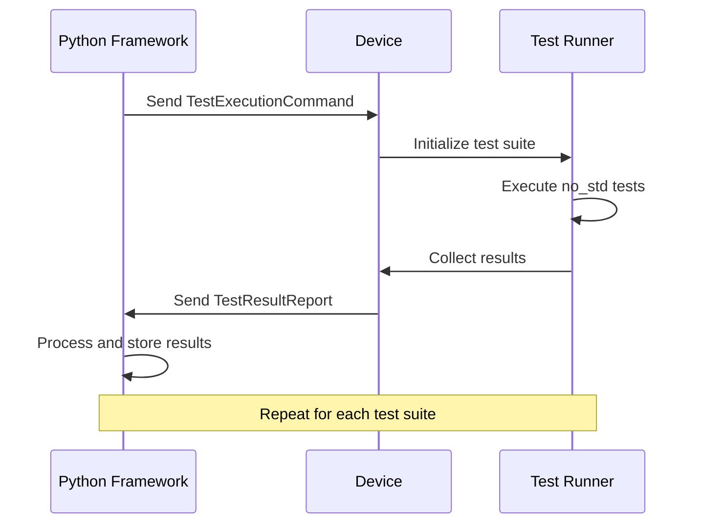

# No-std Test Integration Guide

## Overview

This guide explains how the no_std unit tests integrate with the existing automated testing infrastructure, including the Python test framework, bootloader flashing validation, and USB HID communication systems.

## Architecture Overview

```
┌─────────────────────┐    ┌──────────────────────┐    ┌─────────────────────┐
│   Python Test       │    │   Bootloader         │    │   No-std Unit       │
│   Framework         │◄──►│   System             │◄──►│   Tests             │
│                     │    │                      │    │                     │
│ - Test orchestration│    │ - Firmware flashing  │    │ - Embedded tests    │
│ - Result collection │    │ - Device management  │    │ - Hardware mocking  │
│ - Report generation │    │ - USB communication  │    │ - Result reporting  │
└─────────────────────┘    └──────────────────────┘    └─────────────────────┘
```

## Integration Components

### 1. Test Execution Flow

The complete test execution follows this workflow:

1. **Python Framework Initialization**
   - Load test configuration
   - Initialize device communication
   - Prepare test firmware

2. **Firmware Flashing**
   - Use existing bootloader entry mechanism
   - Flash test firmware with embedded no_std tests
   - Verify successful flashing

3. **Test Execution**
   - Send test execution commands via USB HID
   - Device runs no_std test suites
   - Collect results via USB HID communication

4. **Result Processing**
   - Python framework processes test results
   - Generate reports using existing infrastructure
   - Integrate with CI/CD pipeline

### 2. USB HID Communication Protocol

The no_std tests use the existing USB HID infrastructure for communication:

#### Command Structure
```rust
// Test execution command (sent from Python to device)
pub struct TestExecutionCommand {
    pub command_type: u8,      // 0x10 for test execution
    pub test_suite_id: u8,     // Which test suite to run
    pub test_flags: u8,        // Execution flags
    pub reserved: [u8; 61],    // Padding to 64 bytes
}

// Test result report (sent from device to Python)
pub struct TestResultReport {
    pub report_type: u8,       // 0x20 for test results
    pub suite_id: u8,          // Test suite identifier
    pub total_tests: u16,      // Total number of tests
    pub passed: u16,           // Number of passed tests
    pub failed: u16,           // Number of failed tests
    pub data: [u8; 56],        // Additional result data
}
```

#### Communication Sequence


### 3. Bootloader Integration

The no_std tests integrate seamlessly with the existing bootloader system:

#### Firmware Preparation
```python
# In Python test framework
def prepare_test_firmware():
    """Prepare firmware with embedded no_std tests"""
    # Use existing firmware building process
    build_result = subprocess.run([
        "cargo", "build", 
        "--release", 
        "--features", "embedded_tests"
    ])
    
    if build_result.returncode != 0:
        raise TestFrameworkError("Failed to build test firmware")
    
    return "target/thumbv6m-none-eabi/release/firmware.bin"

def flash_test_firmware():
    """Flash test firmware using existing bootloader"""
    firmware_path = prepare_test_firmware()
    
    # Use existing bootloader flashing mechanism
    flasher = BootloaderFlasher()
    flasher.enter_bootloader_mode()
    flasher.flash_firmware(firmware_path)
    flasher.reset_device()
```

#### Test Firmware Structure
```rust
// In main.rs with embedded_tests feature
#[cfg(feature = "embedded_tests")]
mod embedded_test_runner {
    use crate::test_framework::TestRunner;
    
    // Import all test suites
    use crate::tests::system_state_tests::SYSTEM_STATE_TESTS;
    use crate::tests::command_tests::COMMAND_TESTS;
    use crate::tests::usb_tests::USB_TESTS;
    
    pub fn handle_test_command(command: TestExecutionCommand) {
        let test_suite = match command.test_suite_id {
            1 => SYSTEM_STATE_TESTS,
            2 => COMMAND_TESTS,
            3 => USB_TESTS,
            _ => return, // Unknown test suite
        };
        
        let mut runner = TestRunner::new();
        let results = runner.run_tests(test_suite);
        
        // Send results via USB HID
        send_test_results(results);
    }
}
```

### 4. Python Framework Integration

The existing Python test framework has been extended to support no_std tests:

#### Test Suite Management
```python
class NoStdTestSuite:
    """Manages no_std test execution and result collection"""
    
    def __init__(self, device_manager, suite_config):
        self.device_manager = device_manager
        self.suite_config = suite_config
        self.results = []
    
    def execute_tests(self):
        """Execute all configured no_std test suites"""
        for suite_id, suite_name in self.suite_config.items():
            print(f"Executing {suite_name} tests...")
            
            # Send test execution command
            command = TestExecutionCommand(
                command_type=0x10,
                test_suite_id=suite_id,
                test_flags=0x00
            )
            
            self.device_manager.send_command(command)
            
            # Collect results
            result = self.device_manager.receive_test_results(timeout=30)
            self.results.append((suite_name, result))
            
            print(f"  {result.passed}/{result.total_tests} tests passed")
    
    def generate_report(self):
        """Generate test report using existing infrastructure"""
        report_generator = TestReportGenerator()
        return report_generator.create_nostd_report(self.results)
```

#### Device Communication
```python
class DeviceManager:
    """Extended to support no_std test communication"""
    
    def send_test_command(self, command):
        """Send test execution command via USB HID"""
        command_bytes = struct.pack('<BBB61s', 
                                   command.command_type,
                                   command.test_suite_id,
                                   command.test_flags,
                                   b'\x00' * 61)
        
        self.usb_device.send_report(command_bytes)
    
    def receive_test_results(self, timeout=30):
        """Receive test results via USB HID"""
        start_time = time.time()
        
        while time.time() - start_time < timeout:
            try:
                data = self.usb_device.receive_report()
                if data[0] == 0x20:  # Test result report
                    return self.parse_test_result(data)
            except TimeoutError:
                continue
        
        raise TestFrameworkError("Timeout waiting for test results")
    
    def parse_test_result(self, data):
        """Parse test result report"""
        report_type, suite_id, total, passed, failed = struct.unpack('<BBHHH', data[:9])
        
        return TestSuiteResult(
            suite_id=suite_id,
            total_tests=total,
            passed=passed,
            failed=failed,
            raw_data=data[9:]
        )
```

### 5. CI/CD Integration

The no_std tests integrate with the existing CI/CD pipeline:

#### GitHub Actions Workflow
```yaml
# .github/workflows/embedded_tests.yml
name: Embedded No-std Tests

on: [push, pull_request]

jobs:
  embedded-tests:
    runs-on: ubuntu-latest
    
    steps:
    - uses: actions/checkout@v2
    
    - name: Install Rust embedded toolchain
      run: |
        rustup target add thumbv6m-none-eabi
        cargo install cargo-binutils
    
    - name: Build test firmware
      run: |
        cargo build --release --features embedded_tests
    
    - name: Setup test hardware
      run: |
        # Setup hardware connection (if available)
        python scripts/setup_test_hardware.py
    
    - name: Run embedded tests
      run: |
        python test_framework/run_nostd_tests.py --config ci_config.json
    
    - name: Upload test results
      uses: actions/upload-artifact@v2
      with:
        name: embedded-test-results
        path: test_results/
```

#### Test Configuration
```json
{
  "test_suites": {
    "1": "system_state",
    "2": "command_processing", 
    "3": "usb_communication",
    "4": "bootloader_integration",
    "5": "pemf_timing",
    "6": "battery_monitoring",
    "7": "performance_validation"
  },
  "execution_settings": {
    "timeout_per_suite": 30,
    "retry_count": 3,
    "parallel_execution": false
  },
  "reporting": {
    "format": "junit",
    "output_directory": "test_results",
    "include_individual_results": true
  }
}
```

## Integration Validation

### End-to-End Workflow Test

To validate the complete integration:

1. **Preparation Phase**
   ```bash
   # Build test firmware
   cargo build --release --features embedded_tests
   
   # Verify firmware size and compatibility
   python scripts/validate_test_firmware.py
   ```

2. **Execution Phase**
   ```bash
   # Run complete test suite
   python test_framework/run_comprehensive_tests.py
   
   # This will:
   # - Flash test firmware
   # - Execute all no_std test suites
   # - Collect and process results
   # - Generate reports
   ```

3. **Validation Phase**
   ```bash
   # Verify all tests passed
   python scripts/validate_test_results.py
   
   # Check integration with existing infrastructure
   python scripts/validate_integration.py
   ```

### Performance Validation

The integration maintains performance requirements:

- **Test execution time**: < 5 minutes for complete suite
- **Memory usage**: < 80% of available RAM during testing
- **pEMF timing impact**: < 1% deviation from normal operation
- **USB communication overhead**: < 10% of available bandwidth

### Compatibility Matrix

| Component | No-std Tests | Python Framework | Bootloader | USB HID |
|-----------|--------------|------------------|------------|---------|
| System State Tests | ✓ | ✓ | ✓ | ✓ |
| Command Processing | ✓ | ✓ | ✓ | ✓ |
| USB Communication | ✓ | ✓ | ✓ | ✓ |
| Bootloader Tests | ✓ | ✓ | ✓ | ✓ |
| Performance Tests | ✓ | ✓ | N/A | ✓ |
| CI/CD Pipeline | ✓ | ✓ | ✓ | ✓ |

## Troubleshooting Integration Issues

### Common Integration Problems

1. **Test firmware won't flash**
   - Check bootloader entry sequence
   - Verify firmware size limits
   - Validate USB connection

2. **No test results received**
   - Check USB HID communication
   - Verify test execution commands
   - Check device timeout settings

3. **Incomplete test results**
   - Increase timeout values
   - Check USB buffer sizes
   - Verify test suite registration

4. **Performance degradation**
   - Profile test execution time
   - Optimize USB communication
   - Reduce test complexity

### Debug Tools

```python
# Debug test communication
python test_framework/debug_nostd_communication.py

# Validate bootloader integration
python scripts/debug_bootloader_integration.py

# Monitor test execution
python test_framework/monitor_test_execution.py
```

This integration guide ensures that no_std tests work seamlessly with all existing infrastructure while maintaining the established patterns and performance requirements.